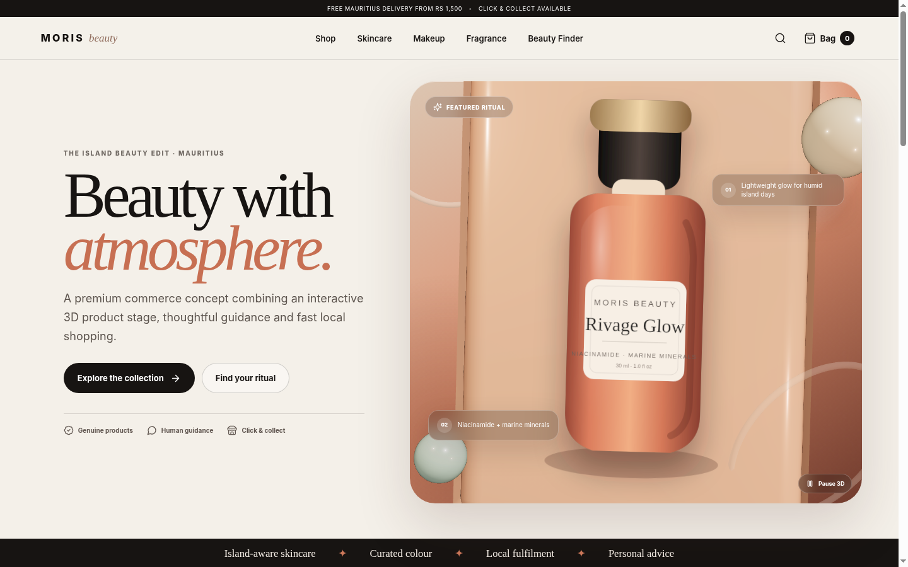
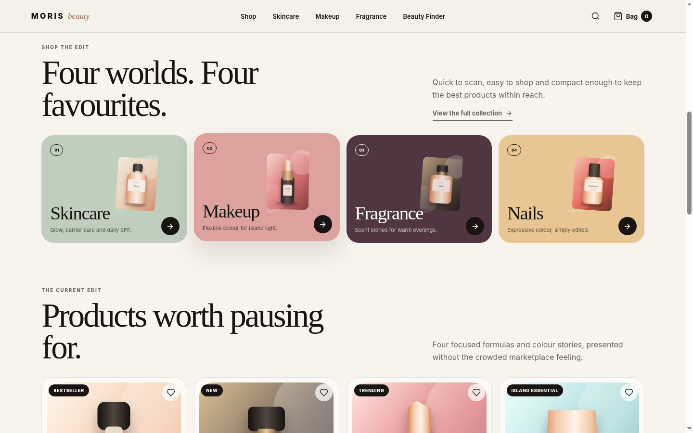
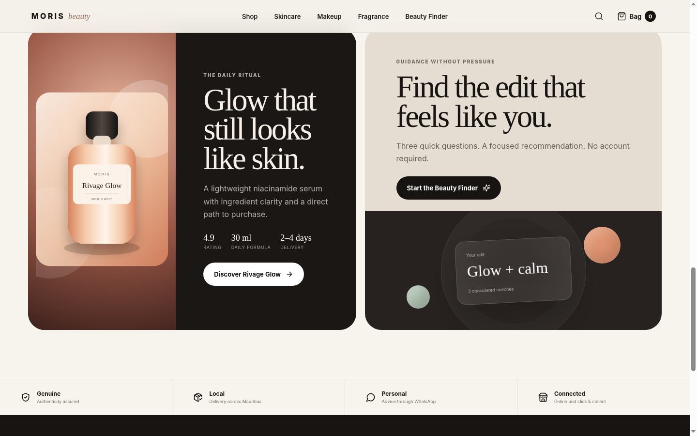
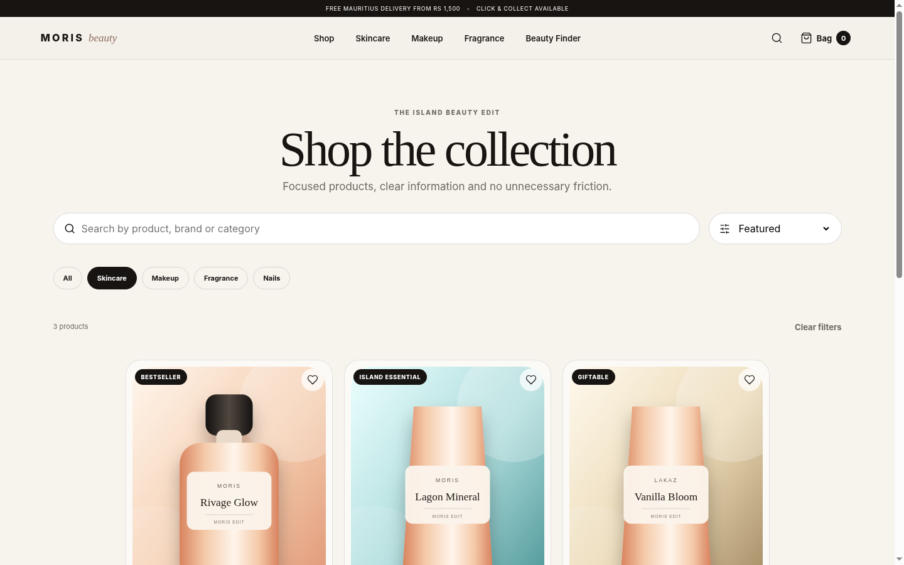

# Moris Beauty — Compact 3D Storefront

A premium, mobile-first beauty-commerce portfolio concept designed for the Mauritian market with **Next.js, TypeScript, React Three Fiber, original product visuals and accessible motion**.

Moris Beauty demonstrates how a storefront can combine a selective 3D product experience with familiar, fast shopping flows. The homepage has been deliberately compressed into four high-value stages so visitors can understand the concept without excessive scrolling.

> **Portfolio boundary:** Moris Beauty is a fictional original brand. The project is not affiliated with Simple.mu or any retailer, and it does not process real orders, payments or personal data.

## Preview

The gallery below reflects the compact v2.1 visual direction; v2.2.0 keeps that art direction while adding static-export and GitHub Pages deployment support.


| 3D hero | Compact commerce section |
|---|---|
|  |  |

| Experience panels | Mobile hero |
|---|---|
|  |  |



## Highlights

- True WebGL hero built with React Three Fiber and Drei
- Layered 3D product stage with restrained pointer parallax and soft floating motion
- Static loading, WebGL-failure and reduced-motion fallbacks
- Compact homepage with substantially less scrolling than earlier releases
- Visual category rail with direct routes into skincare, makeup, fragrance and nails
- Four-product featured edit with compact premium cards
- Searchable catalogue with category filters, sorting and centred filtered results
- Eight original fictional products with MUR pricing
- Static product routes with shades, stock, delivery and click-and-collect details
- Persistent local cart with quantity and fulfilment controls
- Three-step Beauty Finder with transparent recommendation rules
- Public-safe WhatsApp share and advice flows
- GitHub Actions quality workflow, static export and automated GitHub Pages deployment

## v2.2.0 — GitHub Pages Deployment

This release preserves the validated v2.1.3 interface and adds a complete static-hosting pipeline:

1. exports every route to the `out/` directory;
2. deploys automatically through GitHub Actions;
3. supports both project URLs and root `.github.io` sites;
4. resolves public assets correctly when the site is hosted under a repository sub-path;
5. keeps category query links functional on the static `/shop/` route;
6. includes a local static-preview server and deployment guide.

## Technology

- Next.js 16 App Router
- React 19
- TypeScript
- React Three Fiber
- Drei
- Three.js
- Motion for React
- Lucide React
- CSS custom properties and responsive layouts
- Original SVG product artwork used as lightweight visual assets

## Architecture

The application uses server-oriented routes for static commerce content and small client boundaries only where browser state, animation or WebGL is required.

```text
app/
  page.tsx                    Compact homepage experience
  shop/                       Searchable catalogue
  product/[slug]/             Static product routes
  beauty-finder/              Recommendation flow
  cart/                       Cart and fulfilment demo
components/
  hero-scene.tsx              Isolated React Three Fiber scene
  hero-visual.tsx             Lazy loading, pause control and fallbacks
  cart-provider.tsx           Local cart state and persistence
  product-card.tsx            Reusable commerce card
  product-detail-client.tsx   Product interactions
  beauty-finder-client.tsx    Transparent quiz logic
```

More detail is available in [`docs/ARCHITECTURE.md`](docs/ARCHITECTURE.md).

## Run locally

### Requirements

- Node.js 20.9 or newer
- npm 10 or newer recommended

### Installation

```bash
npm ci
npm run dev
```

Open `http://localhost:3000`.

### Static production preview

```bash
npm run build
npm run preview
```

The exported site is written to `out/`.

### Quality checks

```bash
npm run typecheck
npm run lint
npm run build
npm audit --omit=dev
```

## Environment configuration

No credentials are required.

Copy `.env.example` to `.env.local` only when setting the canonical deployment URL:

```env
NEXT_PUBLIC_SITE_URL=https://your-deployment.example
```

Never commit real secrets or payment credentials.

## Deploy to GitHub Pages

The repository includes `.github/workflows/deploy-pages.yml`. After pushing to a public GitHub repository:

1. open **Settings → Pages**;
2. select **GitHub Actions** under Build and deployment;
3. open the **Actions** tab and run or wait for `Deploy to GitHub Pages`;
4. use the deployment URL shown by the completed workflow.

For a repository named `moris-beauty` under `Chatur27`, the expected URL is:

```text
https://chatur27.github.io/moris-beauty/
```

For a root address such as `https://moris-beauty.github.io/`, the repository must belong to a GitHub user or organisation named `moris-beauty` and be named `moris-beauty.github.io`.

See [GitHub Pages deployment](docs/GITHUB_PAGES.md) for the complete setup.

## Deploy to Vercel

1. Push this repository to GitHub.
2. Import it into Vercel.
3. Set `NEXT_PUBLIC_SITE_URL` to the final deployment URL.
4. Deploy using the default Next.js settings.

## Publish to GitHub from Windows

After authenticating GitHub CLI with `gh auth login`, run from the repository root:

```powershell
Set-ExecutionPolicy -Scope Process Bypass

.\scripts\publish-to-github.ps1 `
  -GitHubUsername "YOUR-GITHUB-USERNAME" `
  -CreateWithGitHubCli
```

The helper performs a locked installation, TypeScript validation, linting and a production build before publishing.

## Honest limitations

This project intentionally does **not** claim:

- production authentication or customer accounts;
- a live database or inventory service;
- seller or administrator permissions;
- real MIPS, Juice, card or bank-payment integration;
- real order creation or fulfilment;
- medical or diagnostic recommendations;
- client work for Simple.mu.

The 3D hero is a portfolio demonstration using a lightweight original visual asset inside a WebGL stage. A production retailer would replace the demonstration asset with approved optimised GLB models and photography.

## Documentation

- [Architecture](docs/ARCHITECTURE.md)
- [Portfolio presentation notes](docs/PORTFOLIO_NOTES.md)
- [Security policy](SECURITY.md)
- [Contribution guide](CONTRIBUTING.md)
- [Validation record](VALIDATION.md)
- [Changelog](CHANGELOG.md)

## Licence

Released under the [MIT Licence](LICENSE). Product names, visual compositions and the Moris Beauty identity are original fictional portfolio material.
